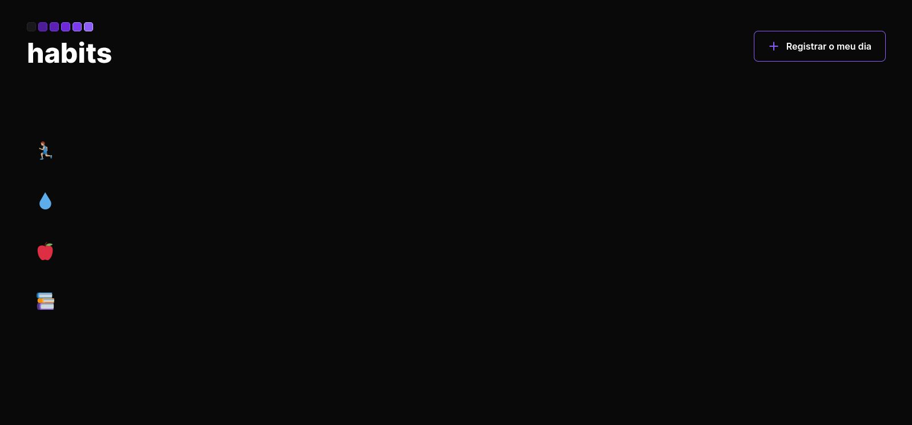
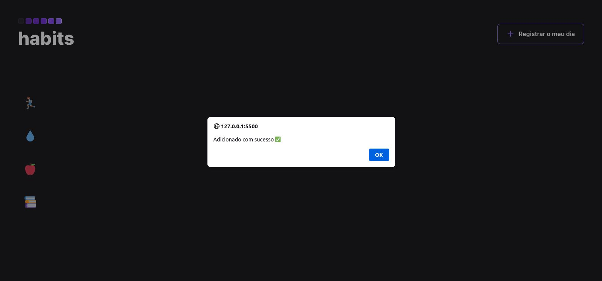
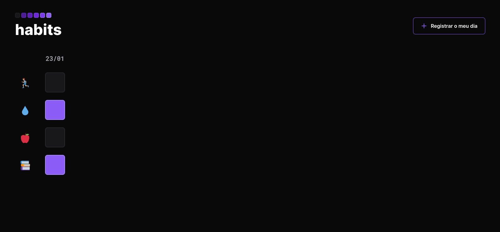
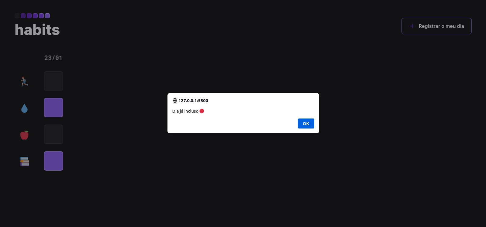

<h1 align="center"> NLW Setup (Habits) </h1>

 

## 🚀 Tecnologias

Esse projeto foi desenvolvido com as seguintes tecnologias:

- HTML e CSS
- JavaScript

 

 
<h3 align="center">Tela inicial </h3>

 
  

 

 
<h3 align="center">Adicionado o dia </h3>

 
  

 

 
<h3 align="center">Selecionando as atividades </h3>

 
  

 

 
<h3 align="center"> Retorno do dia já adicionado </h3>

 
  

 

## 💻 Projeto

o projeto trata-se de um gerenciador de atividades desenvolvido pela **Rocketseat** e foi desenvolvido com o intuito do treino das tecnologias utilizadas.
O projeto também conta com a funcionalidade de dados salvos dentro do storage.
